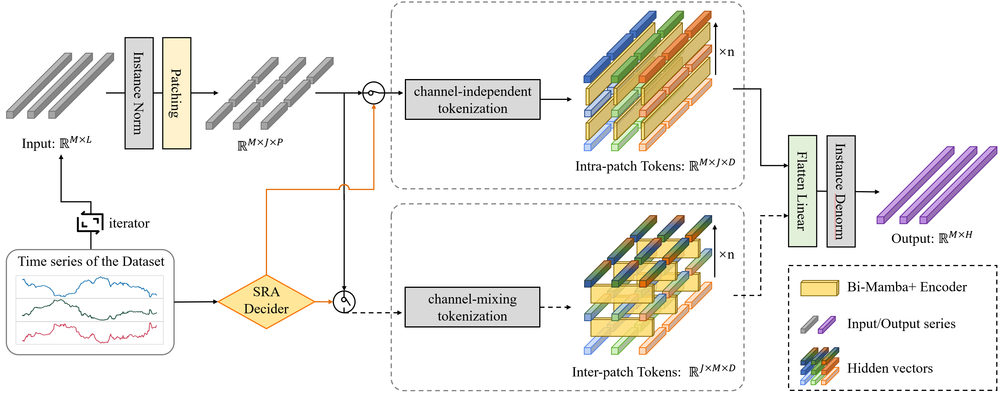
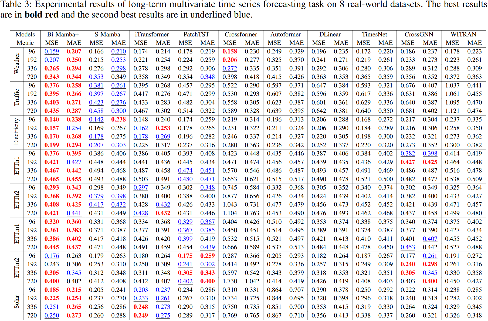

# Bi-Mamba+: Bidirectional Mamba for Time Series Forecasting

  -da282a?style=plastic)        

### This is the official implementation of [Bi-Mamba+: Bidirectional Mamba for Time Series Forecasting](https://arxiv.org/abs/2404.15772).

🚩**News**(May 18, 2024): We update our article [v2] on [arXiv](https://arxiv.org/abs/2404.15772) and provide our [Source Code](https://github.com/Leopold2333/Bi-Mamba4TS) on Github. All experiments are rerun on a new machine and the results are updated. The repo is set private still.

🚩**News**(April 26, 2024): We publish our article [v1] on [arXiv](https://arxiv.org/abs/2404.15772). The repo is currently private.

# Key Designs of the proposed Bi-Mamba+🔑

🤠 Exploring the validity of Mamba in long-term time series forecasting (LTSF).

🤠 Proposing a unified archetecture for channel-independent and channel-mixing tokenization strtegies based on a novel designed series-relation-aware (SRA) decider.

🤠 Proposing Mamba+, an improved Mamba block specifically designed for LTSF to preserve historical information in a longer range.

🤠 Introducing a Bidirectional Mamba+ in a patching manner. The model can capture intra-series dependencies or inter-series dependencies in a finer granularity.





# Datasets

We test Bi-Mamba+ on 8 real-world Datasets: (a) Weather, (b) Traffic, (c) Electricity, (d) ETTh1, (e) ETTh2, (f) ETTm1, (g) ETTm2 and (h) Solar.

All datasets are widely used and are publicly available at [https://github.com/zhouhaoyi/Informer2020](https://github.com/zhouhaoyi/Informer2020 "Informer") and [https://github.com/thuml/Autoformer](https://github.com/thuml/Autoformer "Autoformer").

<!--  -->

# Results✅

## Main Results

Copared to [iTransformer](https://openreview.net/forum?id=JePfAI8fah), the current SOTA Transformer-based model, the MSE results of Bi-Mamba+ are reduced by 4.72% and the MAE results are reduced by 2.60% on average.



## Ablation Study

We calculate the average MSE and MAE results of (i) without SRA decider (w/o SRA-I & w/o SRA-M); (ii) without bidirectional design (w/o Bi); (iii) without residual connection (w/o Residual) (vi) S-Mamba; (v) PatchTST. The SRA decider, bidirectional and residual design are all valid.


# Getting Start🛫

1. Install the Requirements Packages(**Linux only**)

> Run `pip install -r requirements.txt` to install the necessary Python Packages.

> Tips for installing mamba-ssm and our proposed mamba_plus:
> run the following commands in conda (ENTERING STRICTLY IN ORDER!):
```
conda create -n your_env_name python=3.10.13
conda activate your_env_name
pip install torch==2.1.1 torchvision==0.16.1 torchaudio==2.1.1 --index-url https://download.pytorch.org/whl/cu118
conda install packaging
cd causal-conv1d;CAUSAL_CONV1D_FORCE_BUILD=TRUE pip install .;cd ..
cd mamba_plus;MAMBA_FORCE_BUILD=TRUE pip install .;cd ..
```
These python package installing tips is work up to now (04.24 2024).

I strongly recommand doing all these on **Linux**, or, WSL2 on Windows! The default cuda version should be at least 11.8 (or 11.6? seems that new versions allow for lower cuda versions).

The tips listed here will force local compilation of causal-conv1d and mamba_plus. The mamba_plus here is the modified hardware-aware parallel computing algorithm of our proposed **Mamba+**. If you want to run S-Mamba or else Mamba-based models, just go with `cd mamba;pip install .` or `pip install mamba-ssm` in a new python environment to download the original mamba_ssm of **Mamba**. Please use different python environments for `mamba_plus` and `mamba_ssm`, because the `selective_scan` program may be covered by one of them.

Take cuda 11.8 as an example, there should be a directory named 'cuda-11.8' in `/usr/local`. You should make sure that cuda exists in the path. Take `bash` as an example. Run `vi ~/.bashrc` and make sure the following paths exist:
```bash
export CPATH=/usr/local/cuda-11.8/targets/x86_64-linux/include:$CPATH
export LD_LIBRARY_PATH=/usr/local/cuda-11.8/targets/x86_64-linux/lib:$LD_LIBRARY_PATH
export PATH=/usr/local/cuda-11.8/bin:$PATH
```

Of course, if you do not want to force local compilation, these paths are not necessary.

2. Run the script: Find the model you want to run in `/scripts` and choose the dataset you want to use. 
> Run `./scripts/{model}/{dataset}.sh` to start training.

# Acknowledgements🙏
We are grateful for the following awesome works when implementing Bi-Mamba+:

[Mamba](https://github.com/state-spaces/mamba)

[iTransformer](https://github.com/thuml/iTransformer)

# Citation🙂
```
@article{liang2024bi,
  title={Bi-Mamba+: Bidirectional Mamba for Time Series Forecasting},
  author={Liang, Aobo and Jiang, Xingguo and Sun, Yan and Shi, Xiaohou and Li Ke},
  journal={arXiv preprint arXiv:2404.15772},
  year={2024}
}
```
